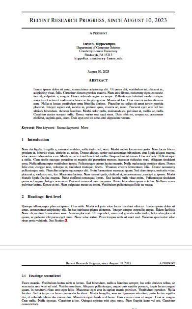
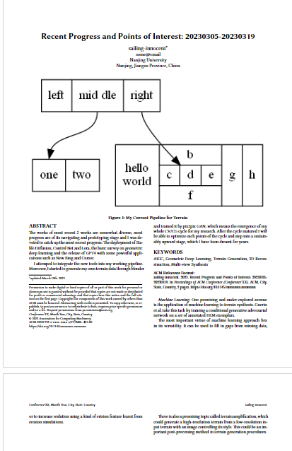
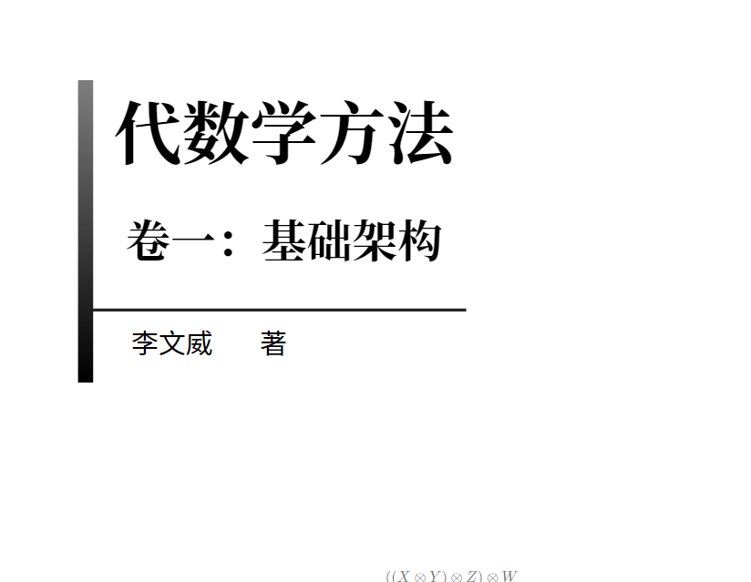
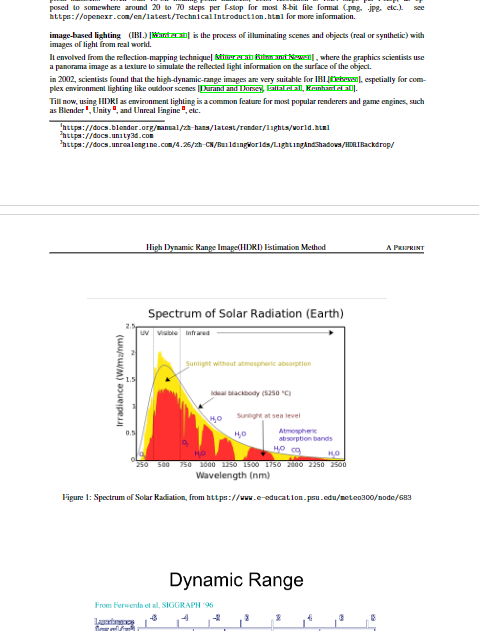
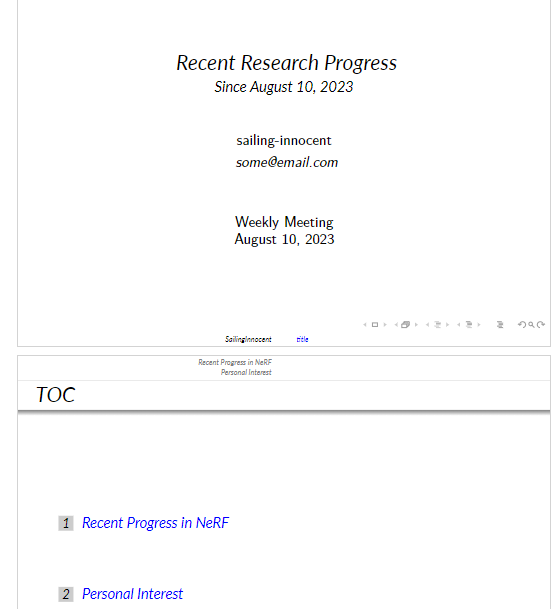

# xmake + latex project example

use xmake and latex to build document gracefully.

## How to build

- install texlive and make sure `latexmk` command is valid
- install xmake and make sure `xmake` command is valid  
- (optional) install graphviz and make sure `dot` command is valid

simply `xmake`

then you will find several pdf files located in your `output` directory.

## templates

Here I demonstrate how to use templates

- arxiv: a single arxiv.sty file, see `doc/template/arxiv` and `doc/sample/arxiv_use` for more info
- acmart: an acmart.cls with Format.dst, see `doc/template/acmart` and `doc/sample/acmart_use` for more info
- AIJabr book: a comprehensive mathematic book example from https://github.com/wenweili/AlJabr-1, see `doc/template/ajbook` and `doc/sample/aljabr` for more info

hint: you have to check the Nato Font installed correctly on your computer for compiling the third example, so by default the example is not open, you can open it by set `xmake f --math_book=true`

- Noto Sans CJK: https://github.com/notofonts/noto-cjk/releases/tag/Sans2.004
- Noto Serif: https://fonts.google.com/noto/specimen/Noto+Serif+SC

remember to install for all users and force clean cache by `fc-cache`

### Arxiv Use

### ACMART Use

### AIJabr Book Use

## a note example

in `doc/note/inverse_rendering_overview` to show a simple note using arxiv template, with bibtex and images, can be used for your homework or personal research note.

## a pre example

in `doc/report/wm20230428` we show an weekly meeting example for a research group, with bibtex

